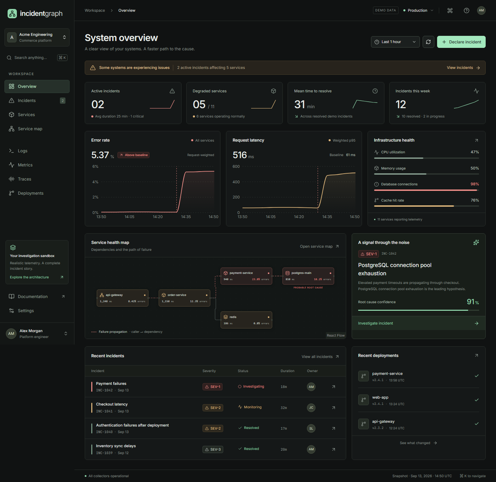
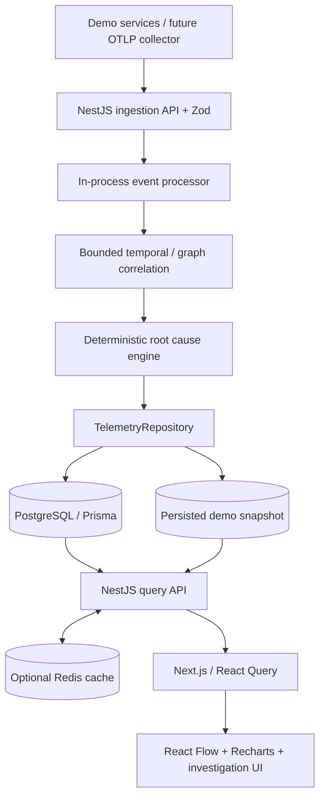
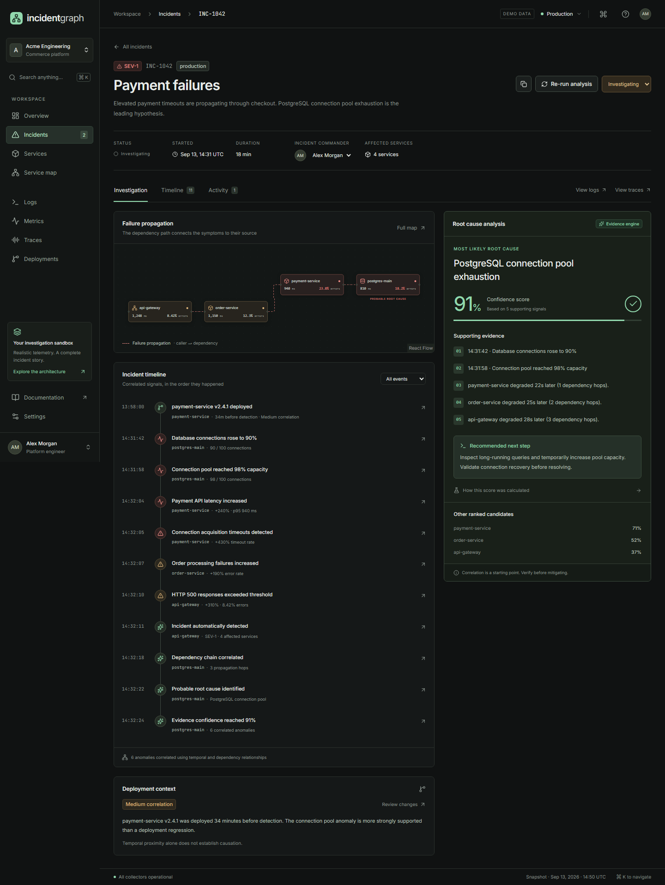

# IncidentGraph

[](https://github.com/tilegen6/incidentgraph/actions/workflows/ci.yml)
[](LICENSE)

**Understand why your systems fail.** An incident investigation platform for distributed systems, with correlated telemetry, an interactive dependency graph, and inspectable deterministic root cause analysis.

A full-stack portfolio MVP: Next.js, NestJS, PostgreSQL, Prisma, Redis, React Flow, Recharts, and strict TypeScript. Includes a public product page, architecture walkthrough, and an immediately usable incident workspace.



[Quick start](#running-locally) · [Three-minute demo](docs/demo-walkthrough.md) · [Engineering case study](docs/case-study.md) · [Architecture](#architecture) · [Verification](#testing)

> **Demo scope:** the included telemetry is synthetic and reproducible. This repository does not collect data from a real business. The ingestion endpoint processes supplied anomaly batches; realtime collection and streaming are future work. No hosted demo is currently published. All localhost links require running the project.

## Engineering Highlights

- **Explainable analysis:** a pure TypeScript engine combines event timing, reverse dependency traversal, anomaly magnitude, and propagation order. Each candidate includes evidence and scoring factors.
- **Durable investigation workflow:** PostgreSQL transactions, idempotent seeding, a repository boundary, and an atomic file-backed demo mode. Concurrent status, owner, and analysis updates are serialized per incident within the API process.
- **Connected telemetry UI:** move from an incident to timeline evidence, service dependencies, logs, and individual trace spans without losing the investigation context.
- **Verifiable behavior:** engine and service tests, real PostgreSQL persistence checks, and browser tests for navigation, mutations, mobile layouts, internal links, and automated accessibility checks.

## Problem

Distributed failures create symptoms in many services. A saturated database can produce payment timeouts, failed orders, and gateway errors within seconds. Separate logs, metrics, and tracing tools expose those symptoms, but the engineer still has to connect them.

## Solution

IncidentGraph places telemetry on a shared timeline, uses service dependencies to correlate anomalies, and ranks root cause candidates with an explicit scoring model. Every hypothesis links back to evidence. Deployment timing is presented as correlation, never proof of causation.

## Features

- System health overview, active incidents, service health, MTTR, metrics, and releases.
- Incident search and server-side filters for severity, status, service, environment, and date; pagination.
- Detailed investigations with evidence, editable status/commander, persisted notes, and re-analysis.
- Interactive React Flow dependency graph, service inspectors, catalog, and health filters.
- Logs explorer with query syntax, severity/service filters, real event histogram, structured JSON, and trace links.
- Seven metric series with service and time selectors: latency, errors, throughput, CPU, memory, database connections, cache hit rate.
- Distributed trace waterfall, nested spans, attributes, longest-span highlighting, and database-wait insight.
- Deployment history and a correlation explanation.
- Global search and Ctrl/Cmd+K command palette.
- Demo authentication, HTTP-only signed sessions, validation, rate limits, origin checks, and structured request logs.
- Dark responsive UI, locally bundled fonts, keyboard controls, focus management, loading/error/empty states.

## Architecture



```text
apps/web/                  Next.js App Router, workspace, landing page
apps/api/src/              REST, authentication, storage, processing, cache
apps/api/prisma/           15 domain models, migration, idempotent seed
packages/shared/src/       Domain contracts, Zod schemas, fixtures, pure analysis
infra/docker/              Separate API and web Dockerfiles
infra/scripts/             Disposable test setup
tests/                     Engine, service, session and browser tests
docs/                      API guide, ingestion example, design system, screenshots
```

`Storage` implements the telemetry repository contract. PostgreSQL stores normalized incident relations and indexed telemetry metadata, with JSON payloads for extensible attributes. The MVP loads a bounded single-project read snapshot; writes commit to PostgreSQL before updating that snapshot. The no-infrastructure demo uses an atomic server-side JSON file, not browser local storage. Redis caches metric queries for 15 seconds when configured and gracefully falls back if unavailable.

## Root Cause Algorithm

Edges point **caller → dependency**. Breadth-first traversal in reverse finds the candidate’s upstream dependents. The scoring path uses only observed affected services. A candidate receives credit for:

| Factor      | Weight | Meaning                                                        |
| ----------- | -----: | -------------------------------------------------------------- |
| Temporal    |    30% | How close its first anomaly is to the incident’s first anomaly |
| Dependency  |    25% | Fraction of affected services reachable upstream               |
| Anomaly     |    25% | Strongest normalized anomaly for the candidate                 |
| Propagation |    20% | Fraction of affected upstream services that degraded later     |

```text
score = 0.91 × (temporal × 0.30 + dependency × 0.25
              + anomaly × 0.25 + propagation × 0.20)
```

The 0.91 multiplier explicitly represents incomplete evidence coverage in this demonstration. **Scores are rankings, not calibrated probabilities.** They do not prove causation. The model is deterministic, does not call an LLM, and returns its factors, evidence, explanation, and version.

Correlation groups connected anomalies within a maximum 120-second window, isolates environments, removes duplicate IDs, and excludes magnitudes below 0.3. The window is bounded from the first event to avoid indefinitely growing incident chains. Batches are independent in v1.

## Demo Scenario

The fixture clock is **September 13, 2026, 14:50 UTC**. It is intentionally fixed so demonstrations remain reproducible. Manual changes use actual server timestamps.

| Time     | Signal                             |
| -------- | ---------------------------------- |
| 13:58:00 | payment-service v2.4.1 deployed    |
| 14:31:42 | PostgreSQL connections rise to 90% |
| 14:31:58 | Connection pool reaches 98%        |
| 14:32:04 | Payment latency increases          |
| 14:32:05 | Payment connection timeouts appear |
| 14:32:07 | Order failures increase            |
| 14:32:10 | Gateway errors increase            |
| 14:32:11 | Incident detected                  |
| 14:32:24 | PostgreSQL ranked first at 91%     |

Seeded content: 11 production services plus isolated staging counterparts, 12 incidents (2 active and 10 resolved), 360 logs, 6,358 metric samples, 32 traces / 128 spans, 8 deployments, dependencies, analysis events, and an investigation note. Other scenarios include Redis saturation and authentication failures after an auth release.

## Tech Stack

| Layer          | Technology                                       |
| -------------- | ------------------------------------------------ |
| Web            | Next.js 16, React 19, TypeScript, Tailwind 4     |
| UI primitives  | shadcn-style CVA buttons, Radix dialogs, Lucide  |
| Data/UI        | TanStack Query, React Flow, Recharts             |
| API            | NestJS 11, Express, Zod                          |
| Storage        | PostgreSQL 17, Prisma 6, optional Redis 7        |
| Analysis       | Pure TypeScript, deterministic graph traversal   |
| Verification   | Vitest, Playwright, ESLint, TypeScript, Prettier |
| Infrastructure | Docker Compose, GitHub Actions                   |

## Running Locally

Use Node.js 24 LTS and npm. From this directory:

```sh
npm ci
npm run db:generate
npm run dev
```

Open [the product](http://localhost:3100), [the workspace](http://localhost:3100/app/overview), or [the main investigation](http://localhost:3100/app/incidents/INC-1042). The API runs at `http://localhost:4100` and the frontend proxies `/api` to it. No `.env` is required for the default demo.

Demo changes persist in `apps/api/.data/snapshot.json` when launched with `npm run dev`. Set `DEMO_DATA_PATH` to choose a different location. Only reset that file if you intend to discard local demo changes.

### PostgreSQL + Redis with Docker

```sh
docker compose up --build
```

The API waits for database health, applies the checked-in migration, and seeds idempotently. Open `http://localhost:3100`. Postgres and Redis use named volumes. Stop with `docker compose down`; keep volumes to retain data. The default Compose configuration is explicitly for local HTTP demo use.

To run the API against your own local PostgreSQL, set `STORAGE_MODE=postgres` and `DATABASE_URL`, then run:

```sh
npx prisma migrate deploy --schema apps/api/prisma/schema.prisma
npm run dev
```

See `.env.example` for values. API `.env` belongs in `apps/api/` (or export the variables); `API_URL` can be set in `apps/web/.env.local`. For production, use HTTPS, set `NODE_ENV=production`, supply unique `SESSION_SECRET` and `DEMO_PASSWORD`, restrict `WEB_ORIGIN`, and configure a real identity provider before admitting non-demo users. The application refuses default credentials/secrets in production mode. Build-time `API_URL` determines the web reverse-proxy destination.

### Production build

```sh
npm run build
npm run start -w @incidentgraph/api
# In a second terminal:
npm run start -w @incidentgraph/web
```

## Demo Credentials

```text
Email:    demo@incidentgraph.dev
Password: investigate-demo
```

The login screen prefills these for the local demo. Browsing is public; creating/updating incidents, re-analysis, ingestion and notes require a session. Replace the password via `DEMO_PASSWORD` when deploying privately.

## Testing

```sh
npm run lint
npm run typecheck
npm test
npm run build
npx playwright install chromium
npm run test:e2e
npm run test:postgres
```

Unit/service tests cover the PostgreSQL → payment → order → gateway cascade, ordering independence, missing evidence, cycle safety, late anomalies, isolation, deduplication, bounded windows, input validation, query semantics, persistence, state changes, concurrent batch admission, and session tampering.

Playwright starts isolated test servers on 3101/4101 with its own `.data/e2e.json` and `.next-e2e` output. It verifies REST errors, sign-in, investigation actions, notes, logs-to-traces navigation, command palette, incident creation, filtering, and mobile overflow. It does not change the interactive demo’s records.

The browser suite also visits all 13 primary screens, checks their internal links and browser errors, and runs axe WCAG 2 A/AA rules. Automated accessibility checks supplement keyboard and visual review; they are not a complete accessibility certification. GitHub Actions runs the verification pipeline on Ubuntu and retains browser failure artifacts for seven days.

## Screenshots



[System overview](docs/screenshots/overview.png) · [Public landing page](docs/screenshots/landing.png)

Screenshots are generated by the browser tests from the running project.

The separate `test:postgres` check starts a native PostgreSQL instance bound to loopback on port 55432, applies migrations, seeds, and verifies persistence after reconnect. Its data stays in `.data/postgres-verification`. The process is stopped in a `finally` block. Docker Compose itself requires Docker Engine and was not executed on the development Windows host.

## API & Design Notes

- [REST API and ingestion examples](docs/api.md)
- [Sample ingestion batch](docs/sample-ingestion.json)
- [Design system and accessibility decisions](docs/design-system.md)
- [Interactive architecture walkthrough](http://localhost:3100/architecture)
- [Three-minute demo script](docs/demo-walkthrough.md)
- [Engineering case study and tradeoffs](docs/case-study.md)
- [Resume and LinkedIn descriptions](docs/portfolio.md)

## Scope and Future Improvements

This is a production-structured **portfolio MVP**, not a live monitoring service. Telemetry is seeded. The UI does not claim to observe the host machine. Real OTLP collection, multi-tenant authorization, streaming anomaly detection, and calibrated confidence are not implemented.

The current event processor is synchronous, serial, and single-instance. Correlation happens within each batch. The query snapshot is bounded (10,000 logs, 20,000 metric points, 1,000 traces when loading PostgreSQL); read filters and pagination operate in the API process. Before scaling, move large queries to indexed database repositories, add retention, transactional deduplication, cross-batch correlation, and shared rate limits.

Planned extensions: real OpenTelemetry ingestion, Kafka event streaming, ClickHouse log storage, anomaly detection models, Kubernetes events, PagerDuty, Slack alerts, GitHub deployment correlation, OAuth, and optional AI summaries grounded in the structured evidence. AI would summarize the deterministic result, not replace it.

## Author and License

Created by [Tlegen6](https://github.com/tilegen6). Released under the [MIT License](LICENSE). Third-party dependencies retain their respective licenses.
